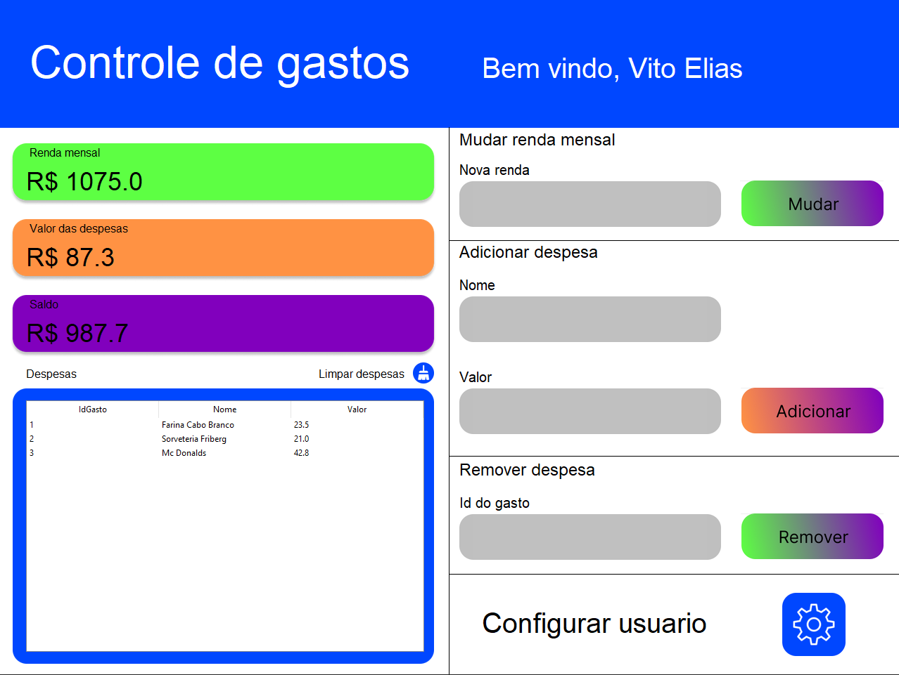
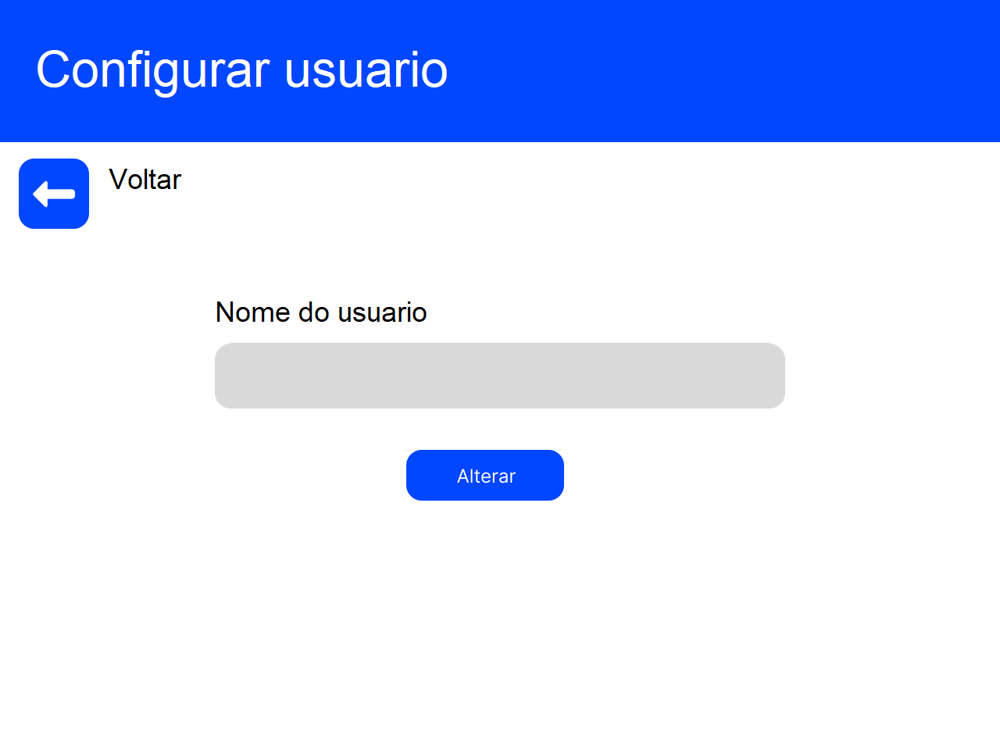

# Sistema de controle de gastos
O sistema tem como finalidade auxiliar no controle mensal de gastos. Ele possui funcionalidades que permitem ajustar a renda mensal e adicionar ou remover um gasto. A fim de praticar o roteamento de páginas, foi criada uma segunda página que permite apenas mudar
o nome do usuário.

 
  
  

## Front-end
- Tkinter
- [Tkinter Designer][tkdesigner]
  - Tkinter Designer é um código em Python feito pela comunidade que converte automaticamente um design do Figma em código Python, utilizando a biblioteca Tkinter para design gráfico.
- [Figma][figma]

## Back-end
- Python
- sqlite3

## Requirements
- Python 3.10.4
- db-sqlite3 0.0.1

[tkdesigner]: https://github.com/ParthJadhav/Tkinter-Designer
[figma]: https://www.figma.com/
